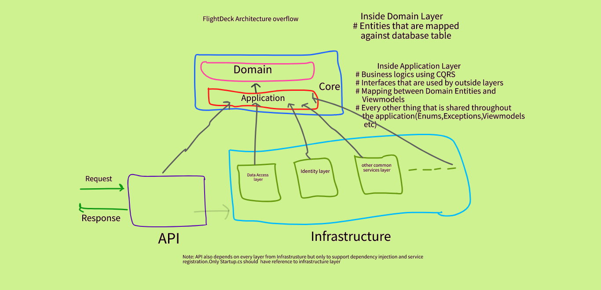
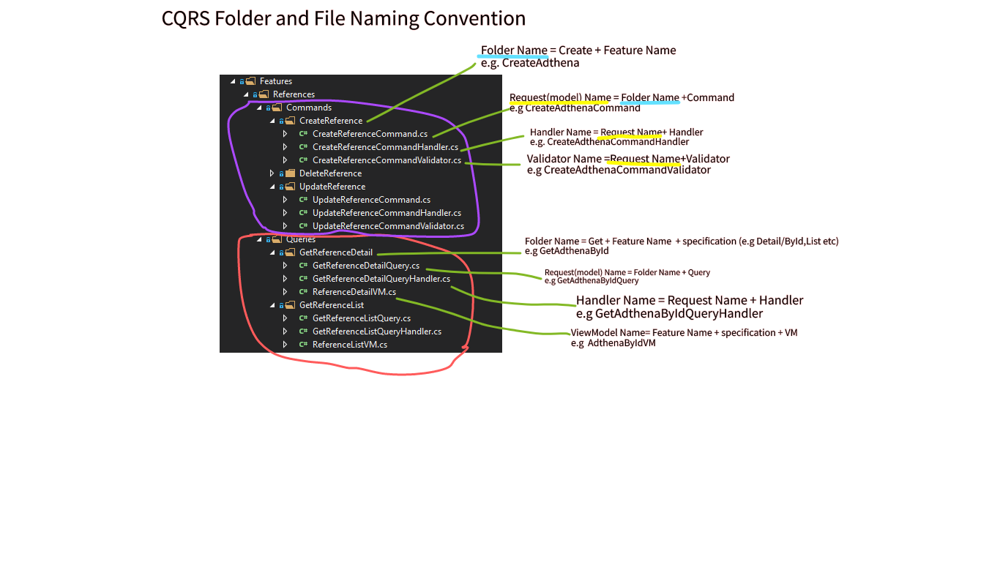
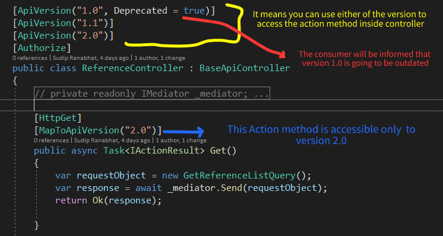


#### FlightDeck Architecture
***
This application follows the **Clean Architecture** guidance.The image below shows the blueprint of flightdeck in a simple understanding way.

#### CQRS
***
There are lots of articles about CQRS pattern which you can easily find in internet. So, we are just going to explain the CQRS Naming-Convention we are using in FlightDeck.
 

#### Routing and ActionMethod Naming-Convention
***
|Purpose|Http Verb|Action Method Name in Controller|Route Syntax|   Example  |
|----|-----|-----|-------|-------|      
|Create Data|HttpPost|Post|api/controller Name|api/adthena|
|Update Data|HttpPut|Put|api/controller Name/id paramater|api/adthena/7|
|Delete Data|HttpDelete|Delete|api/controller Name/id paramater|api/adthena/7|
|Fetch particular data|HttpGet|Get|api/controller Name/id paramater|api/adthena/7|
|Fetch list of data|HttpGet|Get|api/controller Name|api/adthena|

#### API Versioning
***
The image below describes which attributes are used and how they are used

